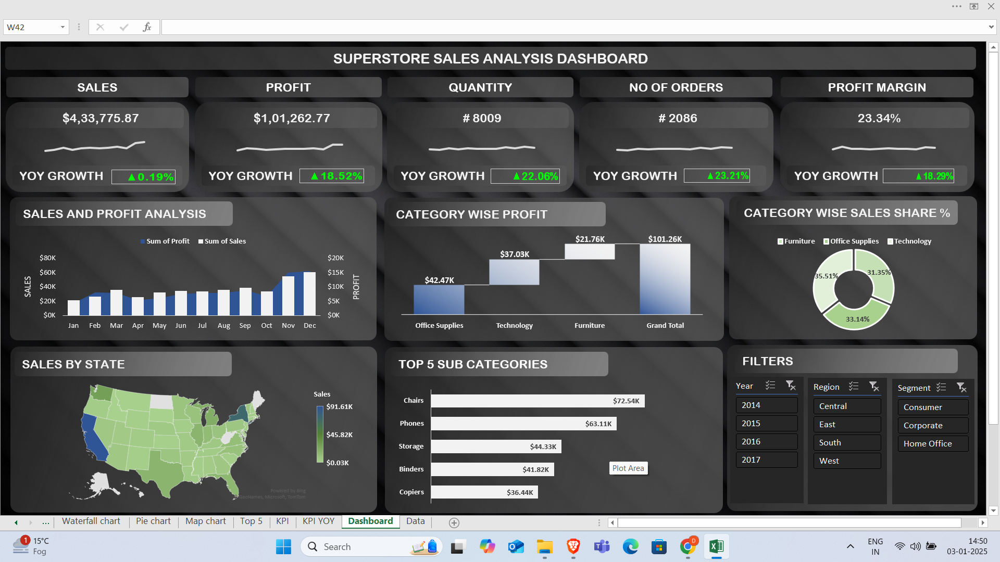
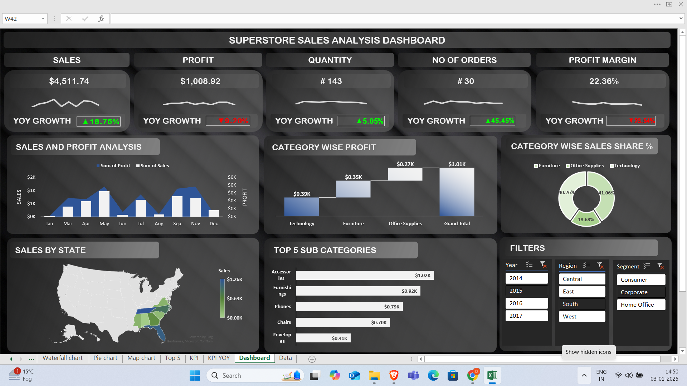
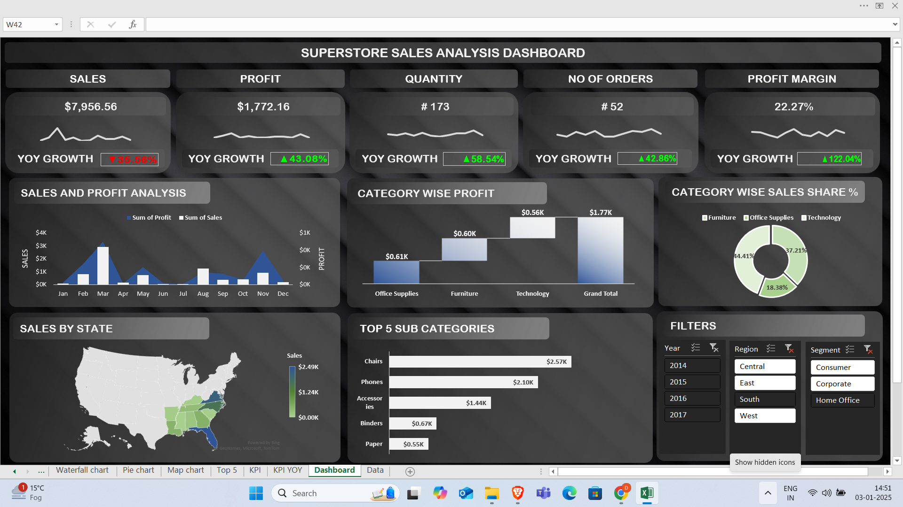

# Superstore Data Analysis and Dashboard Project

This project involves analyzing and visualizing Superstore sales data using SQL and Excel. The goal is to clean, analyze, and visualize the data to gain actionable insights for decision-making.

## Features
- **Data Cleaning**: Removed duplicates, handled missing values, and ensured data integrity using SQL.
- **Data Analysis**: Key metrics such as total sales, profit, and regional performance calculated.
- **Interactive Dashboard**: Created in Excel with visualizations like combo charts, pie charts, and KPIs.

## Tools Used
- SQL
- Excel
- Kaggle (Dataset source)

## Dataset
- **Source**: [Kaggle Superstore Dataset](https://www.kaggle.com/)
- **Description**: Sales data including transactions, customer details, and regional performance metrics.

- ## Media

### Dashboard Preview

### Walkthrough Video
[Download Walkthrough Video](Media/Dashboard_working.mp4)

## How to Use
1. Open the SQL script in your SQL editor to view or run the data-cleaning queries.
2. Open the Excel file to interact with the dashboard.
3. Explore the media folder for a walkthrough video or screenshots.

## Results
- Total sales and profits by category.
- Regional performance analysis.
- Top-performing products and customers.

## Contact
Feel free to reach out for any queries or collaborations:  
[deepakbhatia70561@gmail.com] | [https://www.linkedin.com/in/deepak-bhatia70/]
